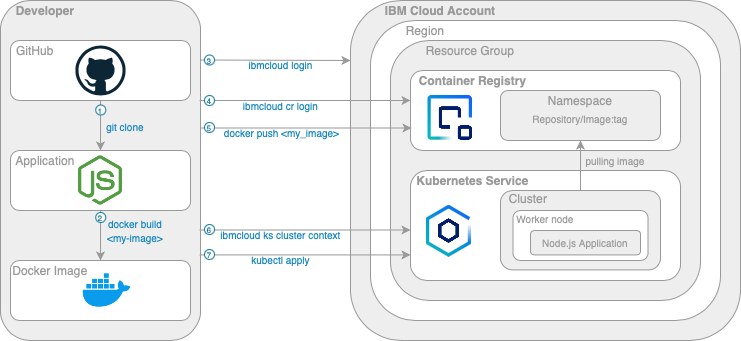

# IBM-Cloud-Guide
This repository contains a source code for IBM Cloud Step by step guide.

The purpose of this project is to deploy a simple node.js application to Kubernetes on IBM Cloud.



---
## Prerequisities
1. You are going to work with your command line/terminal. On MacOS, look for Terminal. On Windows, look for Command Prompt (Command line), and if you have Linux, you will surely know :)
1. Install  [git for Windows](https://git-scm.com/download/win), [git for Linux](https://git-scm.com/download/linux), or [git for macOS](https://git-scm.com/download/mac)
1. Install [Docker](https://docs.docker.com/get-docker/) of version at least 19.03.13
1. Install [IBM Cloud CLI](https://cloud.ibm.com/docs/cli?topic=cli-getting-started)
1. Install [IBM Cloud CLI](https://cloud.ibm.com/docs/cli?topic=cli-getting-started) plugin for _Kubernetes Service_

    ```
    $ ibmcloud plugin install kubernetes-service
    ```
1. Install [IBM Cloud CLI](https://cloud.ibm.com/docs/cli?topic=cli-getting-started) for _Container Registry_
    ```
    $ ibmcloud plugin install container-registry
    ```
---
## Tutorial
1. Clone the repository

    Open command line and navigate to your preffered folder/directory. 

    Examle:
    ```
    $  cd Desktop/MyProjects
    ```
    Clone this repository:

    ```
    $  git clone https://github.com/IBM/CZ-IBM-Cloud-Guide.git
    ```
    > If you are facing any troubles, look at the official documentation for [cloning a repository](https://docs.github.com/en/repositories/creating-and-managing-repositories/cloning-a-repository)


1. Create IBM Cloud account [here](https://cloud.ibm.com/registration). To create an account follow the tutorial in the IBM Cloud Guide in chapter 4.
1. Login to your IBM Cloud account [here](https://cloud.ibm.com/login)
1. Create `Kubernetes Service` in IBM Cloud [here](https://cloud.ibm.com/kubernetes/catalog/create)
    1. As `Pricing plan` choose `Free`
    1. Optionally change `Cluster name` and `Resource group`
    1. Click `Create`
1. Create `namespace` in `Container Registry` [here](https://cloud.ibm.com/registry/namespaces)
    1. Before creating the namespace, choose your preffered location
    1. Optionally change `Resource group`
    1. Fill in `Name` 
    1. Click `Create`
1. Login to IBM Cloud
     ```
    $ ibmcloud login -sso 
    ```
    Output:
    >Paste `y` to get one time password in browser and then copy and paste the one time password. Otherwise open the URL in browser manually.
    ```
    API endpoint: https://cloud.ibm.com
    Region: eu-de

    Get a one-time code from https://identity-2.uk-south.iam.cloud.ibm.com/identity/passcode to proceed.
    Open the URL in the default browser? [Y/n] > 
    ``` 
    
1. Login to the [Container Registry](https://cloud.ibm.com/docs/Registry?topic=Registry-getting-started)
    ```
    $ ibmcloud cr login
    ```
    Output:
    
    ```
    Logging in to 'registry.eu-de.bluemix.net'...
    Logged in to 'registry.eu-de.bluemix.net'.
    Logging in to 'de.icr.io'...
    Logged in to 'de.icr.io'.

    OK
    ``` 
    > The most important issue here is to login to the correct Container Registry. Note, that in the output is `Logged in to 'de.icr.io'`. The `de.icr.io` is specific for a Container Registry located in Frankfurt. For example, Contrainer Registry in London would be `uk.icr.io` or Global Container Registry is `icr.io`. You will be automatically logged in to the registry in as is in your ibm cloud target. You can see the target by running `ibmcloud target` after logging to ibm cloud account. 

1. Get your Kubernetes cluster context

    ```
    $ ibmcloud ks cluster config --cluster <your_cluster_id>
    ```
    >In order to be able to deploy an application to your cluster, you need to store the context of the cluster locally, for which you need to obtain a Cluster ID. Therefore, go to the Kubernetes Cluster in the user interface in the browser via the upper left menu, select [Resource list](https://cloud.ibm.com/resources), then click on Clusters and select your cluster. Here you can see and copy the Cluster ID.

1. Create Docker Image
    
    Navigate to the root of this project. To make sure you are in the root paste the following command and see if you can see your repository:

    For MacOs/Linux
     ```
    $ ls 
    ```

    For Windows:
      ```
    $ dir
    ```

    Output:
    ```
    Dockerfile      
    README.md       
    app             
    deployment.yml
    ```
    To create a docker image, run the following command:
     ```
    $ docker build -t <provider>/<my_namespace>/<my_repo>:<my_tag> .
    ```
    >The `<provider>` is a name of the container registry provider. Depending on your provider choose the correct name. In case of the container registry in IBM Cloud it depends on the location of your registry. Make sure you are using the location, which your namespace is created in. To obtain the correct value, go to [images](https://cloud.ibm.com/registry/images) in IBM Cloud, choose your location and click **create**. 

    >The `<my_namespace>` is the namespace you have created in Container Registry. Paste the name of a namespace, that you have created.
    
    >The `<my_repo>` is a name of a repository in [Repositories](https://cloud.ibm.com/registry/repos). The repository will be created automatically, so there is no need to create it. You can use any value for `<my_repo>`.  
    
    >The `<my_tag>` can either contain any text or number value. For example, you can paste a version of this image like `0.0.1` or `latest`.

    > Make sure, the docker is running. 
    

    The tag is now visible by running this command:
     ```
    $ docker image ls
    ```

1. Push Docker Image to your Container Registry

    ```
    $ docker push <provider>/<my_namespace>/<my_repo>:<my_tag>
    ```
    > The created Docker Image needs to be pushed to the Container Registry in order for Kubernetes Service to retrieve this Docker Image. Your image will now be displayed in the IBM Cloud Container Registry under [images](https://cloud.ibm.com/registry/images).
    
1. Update the image tag (name) in `deployment.yml` file instead of `*`
    ```
    spec:
      containers:
        - name: nodejs
          image: *
          imagePullPolicy: Always
          ports:
            - containerPort: 3000
    ```
    > The image tag(name) is the value, that you used while building and pushing the docker image: `<provider>/<my_namespace>/<my_repo>:<my_tag>`

1. Deploy the application into Kubernetes cluster
    >The file `deployment.yml` in the root of the project contains a script, which processes the deployment automatically. The objective is to apply this deployment template.
    ```
    $ kubectl apply -f deployment.yml
    ```
    
1. Navigate to your `Kubernetes cluster` in IBM Cloud, click on `Worker nodes` and copy the `Public IP`. 

    Paste the IP adress to your browser and add nodePort `30080`.
    >The port can be changed in `deployment.yml` file.

    Example:
    ```
    http://159.122.177.240:30080
    ```
    Congratulations! Now you are able to see the application in browser!


## Troubleshooting

You might face issues while working on this guide. Here are the most common ones and the solution.
### Docker deamon is not running

Do you get a similar error after running `docker build` or `docker push`? 

```
Cannot connect to the Docker daemon at unix:///var/run/docker.sock. Is the docker daemon running?
```

The reason is, that your docker is not running. Try to open the application or follow the [official documentation](https://docs.docker.com/config/daemon/)

### The login credentials are not valid

Do you get this error?

```
➜  CZ-IBM-Cloud-Guide git:(main) docker push icr.io/some-namespace/some-repo:1.0
The push refers to repository [icr.io/some-namespace/some-repo]
035d751a3458: Preparing
cf0c0a876640: Preparing
c566b09f3beb: Preparing
e62349c14338: Preparing
ca44545b101f: Preparing
b26bc695d405: Waiting
1a058d5342cc: Waiting
unauthorized: The login credentials are not valid, or your IBM Cloud account is not active.
```
Solution:
1. Make sure, you are logged in to `ibmcloud` by running the following command:

    ```
    ibmcloud target
    ```

1. Make sure you have logged in to Container Registry

    ```
    ibmcloud cr login
    ```
1. Check if the Container Registry that you are logged into matches the location, where your [namespace](https://cloud.ibm.com/registry/namespaces) is created. For example, if your namespace is located in Frankfurt, you need to login to the Container Registry `de.icr.io`. 